# Storefront E-commerce Application

## 1. Introduction

The Storefront E-commerce Application is a comprehensive full-stack solution designed for small to medium-sized businesses looking to establish a robust online presence. This project aims to provide an intuitive and scalable platform for managing products, processing orders, and offering a seamless shopping experience for customers. It solves the problem of building a modern e-commerce platform with a focus on microservices architecture for flexibility and maintainability.

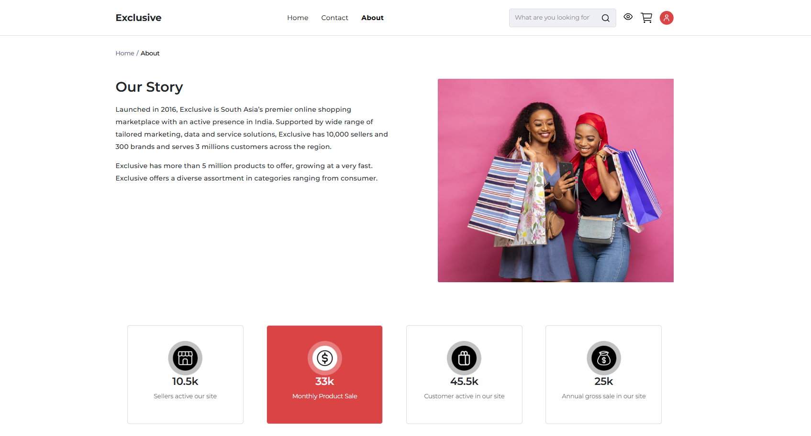

## 2. Architecture Overview

This application adopts a microservices architecture, where different business capabilities are encapsulated into independent services. This approach enhances scalability, fault isolation, and independent deployment. The system consists of a .NET Core backend providing various microservices and an Angular frontend consuming these services through an API Gateway.

### High-Level Design:

*   **Frontend**: Angular single-page application (SPA) for user interaction.
*   **API Gateway**: Acts as a single entry point for all client requests, routing them to appropriate microservices.
*   **Backend Microservices**: Independent .NET Core services handling specific domains (e.g., Product, Cart, Order, User).
*   **Databases**: Each microservice typically manages its own data store, promoting data independence.
*   **Inter-service Communication**: Primarily uses gRPC for high-performance communication between backend services.

## 3. Features

The Storefront application offers a rich set of features for both customers and administrators:

*   **Product Management**: Add, update, delete, and view product details, including images, descriptions, and pricing.
*   **Product Catalog**: Browse and search for a wide range of products with filtering and sorting options.
*   **Shopping Cart**: Add, remove, and manage items in your shopping cart.
*   **User Authentication**: Secure user registration, login, and profile management.
*   **Order Processing**: Place orders, view order history, and track order status.
*   **Microservices Architecture**: Scalable and maintainable design using independent services.
*   **Admin Panel (Planned)**: Future enhancements include an administrative interface for managing products, orders, and users.

## 4. Microservices (Backend – ASP.NET Core)

The backend is composed of several ASP.NET Core microservices, each responsible for a distinct part of the e-commerce domain:

*   **`Storefront.ApiGateway`**:
    *   **Responsibility**: The entry point for all external requests. It routes requests to the appropriate backend services, handles cross-cutting concerns like authentication, and can aggregate responses from multiple services.
    *   **Tech Stack**: Built with ASP.NET Core and utilizes Ocelot for API Gateway functionality.

*   **`Storefront.CartService`**:
    *   **Responsibility**: Manages shopping cart operations, including adding items, updating quantities, and removing items.
    *   **Data Storage**: Uses Entity Framework Core with a dedicated database (e.g., PostgreSQL/SQL Server) for cart data.
    *   **Endpoints**: Provides RESTful APIs for cart manipulation.
    *   **Internal Logic**: Handles business rules related to cart item validation and persistence.

*   **`Storefront.OrderAndShippingService`**:
    *   **Responsibility**: Handles order creation, status updates, and manages shipping details.
    *   **Data Storage**: Uses Entity Framework Core with a dedicated database for order and shipping information.
    *   **Endpoints**: Exposes APIs for placing orders, retrieving order history, and updating shipping status.
    *   **Internal Logic**: Orchestrates the order placement process, including inventory checks (future integration) and payment processing (future integration).

*   **`Storefront.ProductService`**:
    *   **Responsibility**: Manages product catalog, including product details, categories, and inventory.
    *   **Data Storage**: Uses Entity Framework Core with a dedicated database for product information.
    *   **Endpoints**: Provides APIs for retrieving product listings, individual product details, and managing product inventory.
    *   **Internal Logic**: Handles product data validation, search, and filtering.

*   **`Storefront.UserService`**:
    *   **Responsibility**: Manages user accounts, authentication, and authorization.
    *   **Data Storage**: Uses Entity Framework Core with a dedicated database for user profiles and credentials.
    *   **Endpoints**: Exposes APIs for user registration, login, profile management, and password reset.
    *   **Internal Logic**: Integrates with identity providers, handles password hashing, and token generation.

## 5. Frontend (Angular Application)

The frontend is a dynamic single-page application built with Angular, providing an interactive user interface:

*   **UI Structure**: Organized into modules for different features (e.g., AuthModule, ProductModule, CartModule, OrderModule).
*   **Components**: Reusable UI components for consistent design and functionality.
*   **Routing Approach**: Utilizes Angular's Router for client-side navigation, providing a smooth user experience without full page reloads.
*   **Connection to Backend APIs**: Communicates with the backend microservices via the API Gateway using Angular's `HttpClient` for RESTful API calls. Data fetching, form submissions, and state management are handled within the Angular application.

## 6. API Gateway (Ocelot)

The `Storefront.ApiGateway` project uses Ocelot to manage incoming API requests:

*   **Request Routing**: Directs client requests to the appropriate downstream microservices based on configured routes.
*   **Authentication**: Centralizes authentication logic, authenticating requests before forwarding them to internal services. This offloads authentication concerns from individual microservices.
*   **Aggregation**: (Future Enhancement) Can aggregate responses from multiple microservices into a single client response, reducing the number of requests a client needs to make.

## 7. Authentication & Authorization

*   **Authentication**: Users are authenticated using JWT (JSON Web Tokens). Upon successful login via the `UserService`, a JWT is issued to the client. This token is then sent with subsequent requests to the API Gateway.
*   **Authorization**: (Role-Based Access Control - RBAC) The API Gateway and individual microservices can enforce authorization rules based on roles embedded in the JWT. This ensures that only authorized users can access specific resources or perform certain actions.

## 8. Database & Persistence

*   **Data Storage**: Each microservice is designed to have its own dedicated database (polyglot persistence is an option, but currently, all use SQL-based databases via Entity Framework Core). This ensures loose coupling and data autonomy for each service.
*   **Schema Design**: Database schemas are designed independently for each service, reflecting its specific domain model.
*   **Migrations**: Entity Framework Core migrations are used to manage and evolve database schemas for each service.
*   **Data Ownership**: Each microservice is the sole owner of its data. Services do not directly access another service's database. Communication between services for data retrieval is done via their exposed APIs.

## 9. Communication Between Services

*   **gRPC**: Primarily, inter-service communication between backend microservices is achieved using gRPC for high-performance, contract-based communication. This ensures efficient data exchange and strong type safety.
*   **REST (Internal)**: Some internal service communication might also use RESTful APIs where gRPC might be overkill or for simpler interactions.
*   **Event-Based Communication (Future)**: Future enhancements might include event-driven architecture using message queues (e.g., RabbitMQ, Kafka) for asynchronous communication and handling domain events (e.g., "OrderPlaced" event).

## 10. Caching & Performance

*   **Caching Strategies**:
    *   **Distributed Caching**: Utilizing technologies like Redis for shared cache across multiple instances of services to store frequently accessed data (e.g., product lists, user profiles).
    *   **In-Memory Caching**: Local caching within individual service instances for very hot data, where appropriate.
*   **Performance Optimizations**:
    *   **Asynchronous Programming**: Extensive use of async/await in .NET Core to improve responsiveness and scalability.
    *   **Database Optimization**: Indexing, query optimization, and efficient data retrieval patterns.
    *   **Lazy Loading**: Strategically applied to reduce initial load times.
*   **CDN Usage (Future)**: For static assets like product images and frontend bundles to deliver content faster globally.
*   **Response Speed Improvements**: Minification and bundling for frontend assets, compression (Gzip/Brotli) for API responses.

## 11. Logging & Monitoring

*   **Logging**:
    *   **Structured Logging**: Employing Serilog for structured logging across all .NET Core microservices. This allows logs to be easily queried and analyzed.
    *   **Log Sinks**: Logs are configured to be sent to various sinks, such as console, file, and potentially a centralized logging system.
*   **Monitoring (Future)**:
    *   **Centralized Logging**: Integration with a centralized logging solution like ELK Stack (Elasticsearch, Logstash, Kibana) or Azure Application Insights for aggregation, searching, and visualization of logs across all services.
    *   **Application Performance Monitoring (APM)**: Tools like Prometheus/Grafana or Azure Monitor for tracking service metrics, health, and performance.
    *   **Distributed Tracing**: Implementing distributed tracing (e.g., OpenTelemetry) to track requests as they flow through multiple microservices, aiding in debugging and performance analysis.

## 12. Development Setup

To get the project up and running on your local machine, follow these steps:

### Prerequisites

*   [.NET SDK 8.0](https://dotnet.microsoft.com/download/dotnet/8.0): For building and running the backend microservices.
*   [Node.js](https://nodejs.org/en/download/) (LTS version recommended): Required for Angular development.
*   [Angular CLI](https://angular.io/cli): Install globally using `npm install -g @angular/cli`.
*   [Docker Desktop](https://www.docker.com/products/docker-desktop): (Optional, but recommended) For containerization and running databases.
*   **Database Tool**: A SQL client (e.g., SQL Server Management Studio, DBeaver) for managing databases if not using Docker.

### 1. Clone the Repository

```bash
git clone https://github.com/subrahmanya01/storefront.git
cd storefront
```

### 2. Backend Setup

Navigate to the `backend` directory.

```bash
cd backend
```

**Restore NuGet Packages:**

```bash
dotnet restore
```

**Apply Database Migrations:**

For each service that uses a database (e.g., `Storefront.CartService`, `Storefront.OrderAndShippingService`, `Storefront.ProductService`, `Storefront.UserService`), you will need to apply migrations. Replace `<ServiceName>` with the actual service project name (e.g., `Storefront.CartService`).

```bash
dotnet ef database update --project Storefront.<ServiceName>/Storefront.<ServiceName>.csproj
```

**Environment Variables**:
The `appsettings.Development.json` files in each service typically contain development-specific configurations, including database connection strings. Ensure these are correctly set up for your local environment. You might need to create an `appsettings.Local.json` for sensitive information not committed to source control.

### 3. Frontend Setup

Navigate to the `frontend` directory.

```bash
cd ../frontend
```

**Install npm Dependencies:**

```bash
npm install
```

## Running the Application

### Start the Backend Services

From the `backend` directory, it is recommended to run the `ApiGateway` first, followed by other services in separate terminals.

```bash
cd backend
dotnet run --project Storefront.ApiGateway/Storefront.ApiGateway.csproj
# In separate terminals, run other services, e.g.:
dotnet run --project Storefront.CartService/Storefront.CartService.csproj
dotnet run --project Storefront.ProductService/Storefront.ProductService.csproj
dotnet run --project Storefront.OrderAndShippingService/Storefront.OrderAndShippingService.csproj
dotnet run --project Storefront.UserService/Storefront.UserService.csproj
```

### Start the Frontend Application

From the `frontend` directory, start the Angular development server.

```bash
cd frontend
ng serve --open
```

This will open the application in your default browser, usually at `http://localhost:4200`.

## 13. Deployment

### Docker / Docker Compose

The project includes `Dockerfile` for `Storefront.UserService` (and can be added to other services). You can use Docker Compose to build and run all services and their dependencies (like databases) in isolated containers.

```bash
# From the root of the project
docker-compose build
docker-compose up
```

### Kubernetes (Future)

Future plans include container orchestration using Kubernetes for scalable and resilient deployment in production environments.

### CI/CD Pipelines (Future)

Automated CI/CD pipelines (e.g., GitHub Actions, Azure DevOps, GitLab CI) will be implemented to streamline the build, test, and deployment processes.

## 14. Testing

*   **Unit Tests**: Each microservice and frontend module should have unit tests to verify individual components and functions in isolation.
    *   **Backend**: NUnit/xUnit for .NET Core projects.
    *   **Frontend**: Jasmine and Karma for Angular components and services.
*   **Integration Tests**: Test the interaction between different components or services.
    *   **Backend**: Custom integration tests within .NET Core projects to ensure services communicate correctly with their databases and each other.
*   **API Tests**: Validate the functionality and performance of the exposed API endpoints. Tools like Postman or custom HTTP clients.
*   **Frontend Tests**: Cypress or Selenium for end-to-end testing of user flows.

### How to Run Tests

*   **Backend**: Navigate to the respective service directory and run `dotnet test`.
*   **Frontend**: Navigate to the `frontend` directory and run `ng test`.

## 15. Folder Structure

The project maintains a clear and organized folder structure:

*   `README.md`: Project overview and setup instructions.
*   `backend/`:
    *   `Storefront.sln`: Visual Studio solution file.
    *   `Storefront.ApiGateway/`: API Gateway project.
    *   `Storefront.CartService/`: Cart microservice.
    *   `Storefront.OrderAndShippingService/`: Order and Shipping microservice.
    *   `Storefront.ProductService/`: Product catalog microservice.
    *   `Storefront.UserService/`: User management microservice.
    *   Each service folder contains: `Controllers/`, `Entities/`, `Services/`, `Models/`, `Infrastructure/`, `Migrations/`, `Protos/` (for gRPC).
*   `frontend/`:
    *   `angular.json`, `package.json`, `tsconfig.json`: Angular configuration files.
    *   `public/`: Static assets like `icons/`, `product-images/`.
    *   `src/`: Angular application source code (e.g., `app/`, `environments/`, `assets/`).
*   `documentation/`:
    *   `images/`: Contains screenshots and other visual documentation.

## 16. Future Enhancements

*   **Admin Panel**: A dedicated administrative interface for managing products, categories, users, and orders.
*   **Payment Gateway Integration**: Integrate with popular payment providers (e.g., Stripe, PayPal).
*   **Search Functionality**: Advanced product search with full-text search capabilities.
*   **Recommendations Engine**: Implement a system to recommend products to users based on their browsing history or preferences.
*   **Notifications**: Real-time notifications for order status updates, promotions, etc.
*   **Container Orchestration**: Full Kubernetes deployment configuration.
*   **CI/CD Pipelines**: Implement robust CI/CD using GitHub Actions or Azure DevOps.
*   **Event-Driven Architecture**: Introduce message queues for asynchronous communication and domain event handling.

## Screenshots

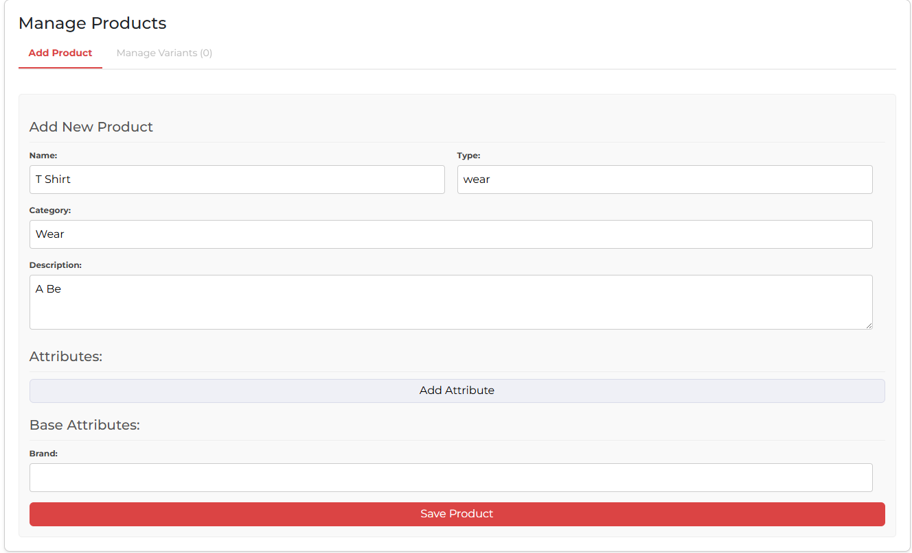
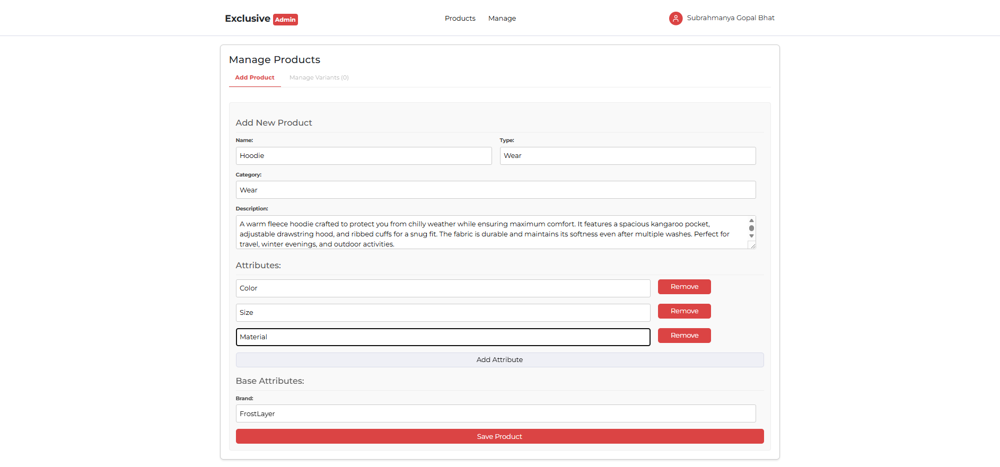
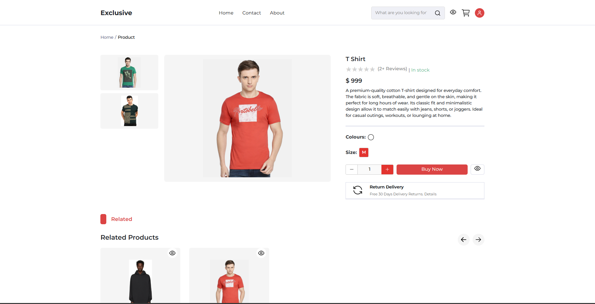
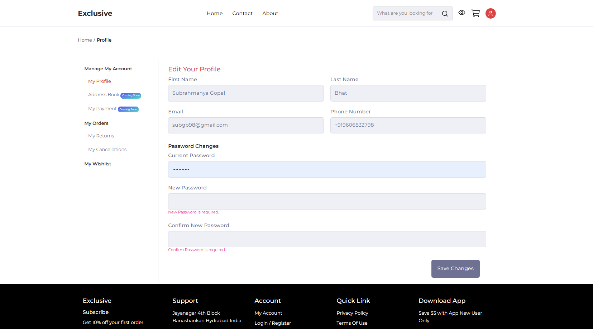
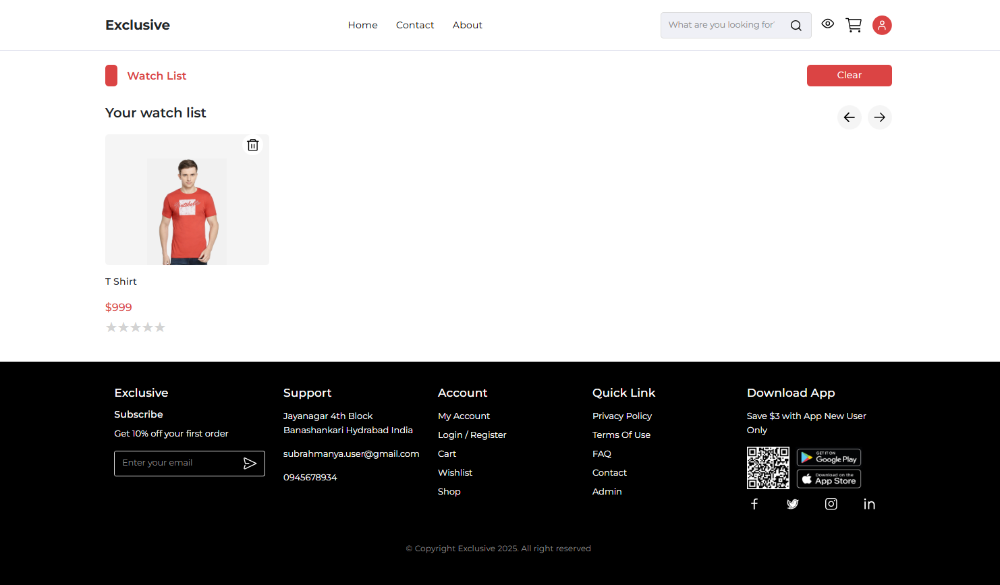
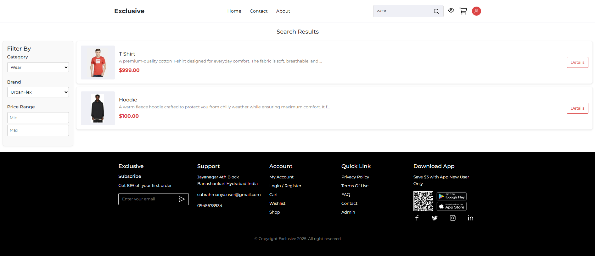
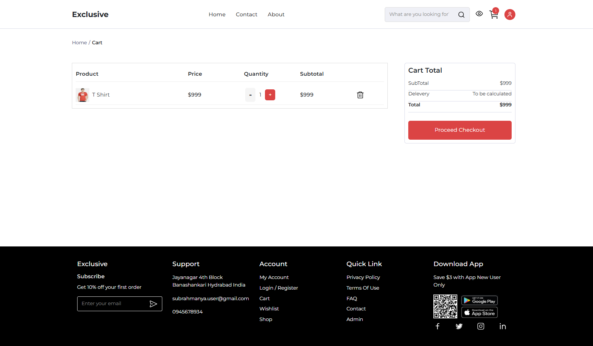
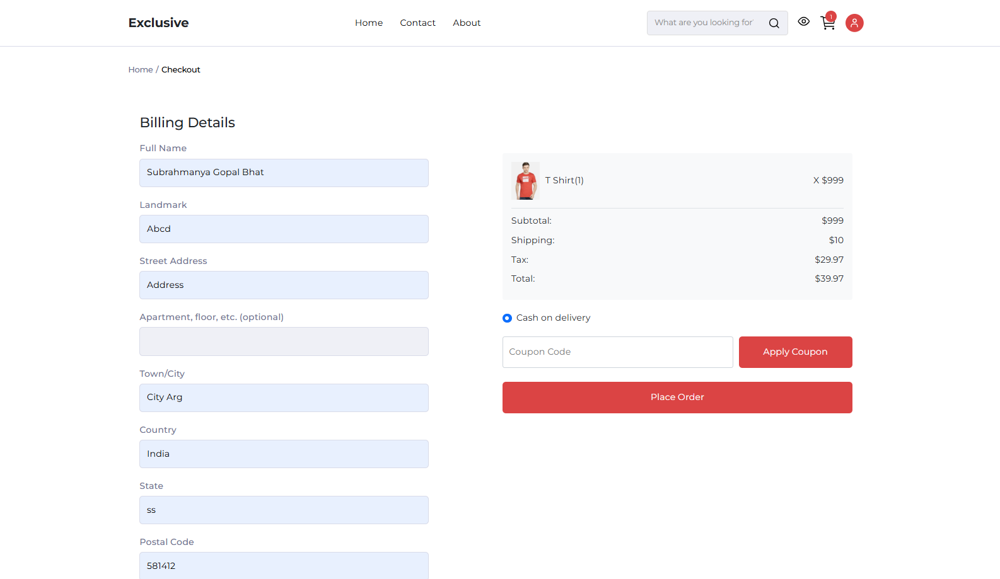
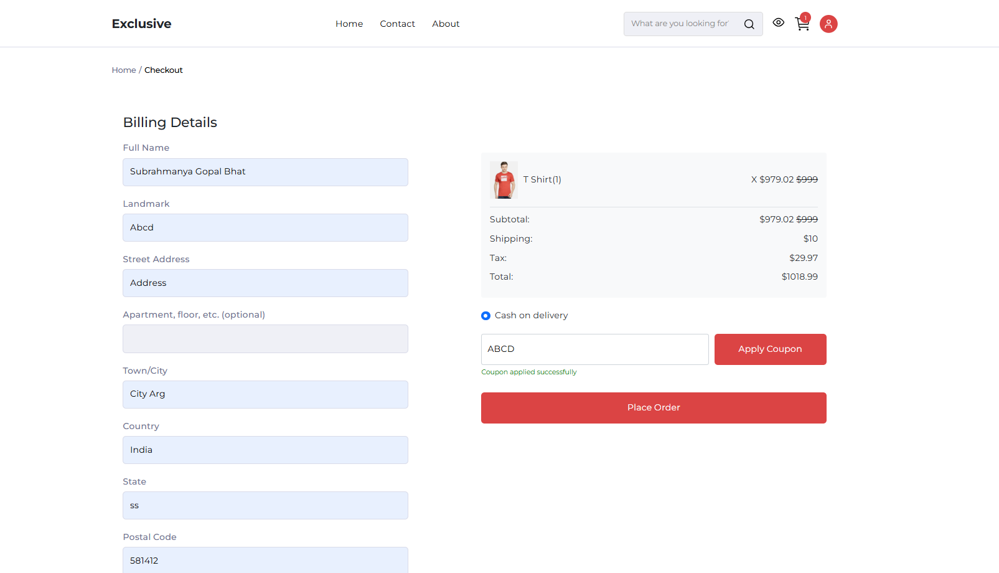
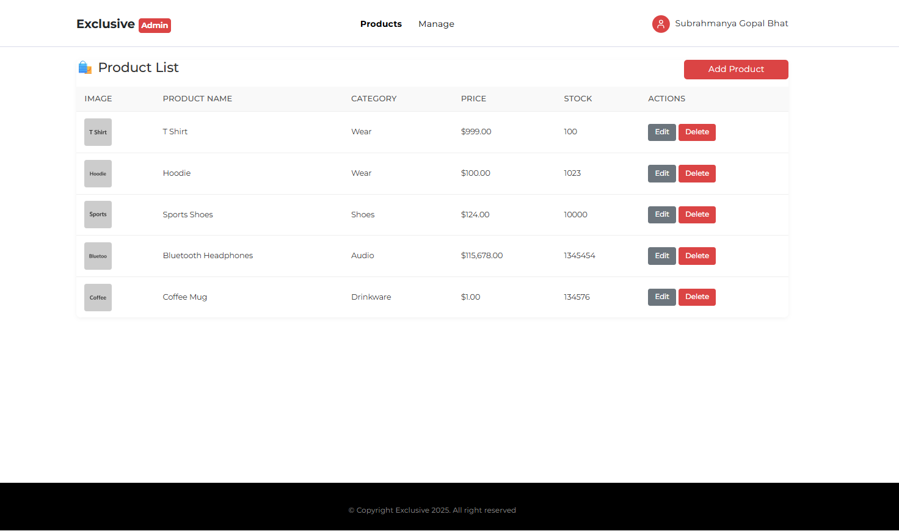
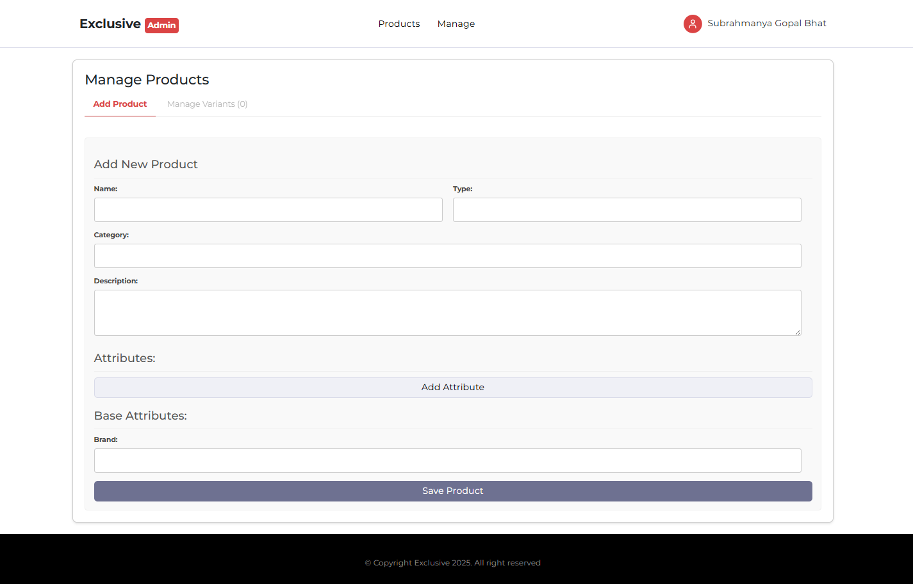
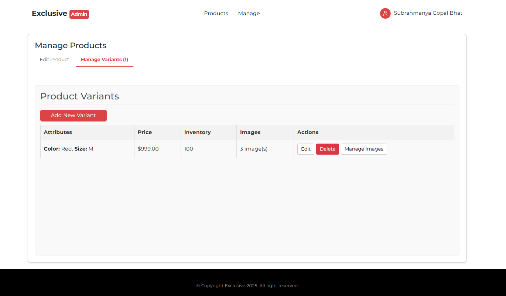
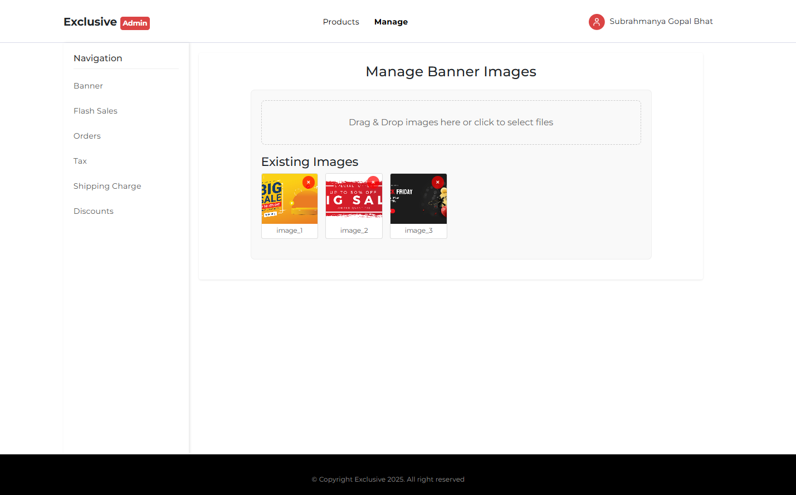
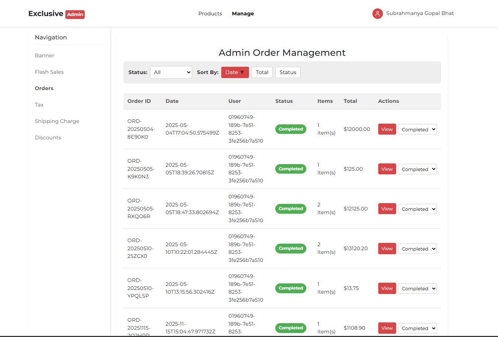

## Contributing

Feel free to fork the repository, open issues, and submit pull requests.
